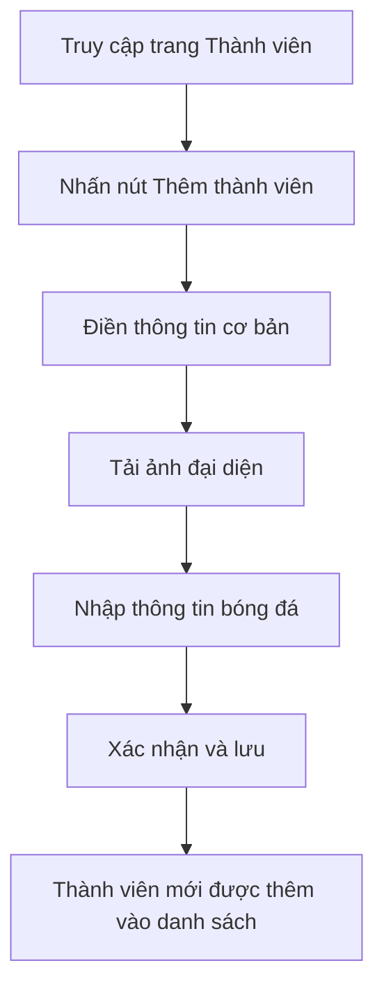
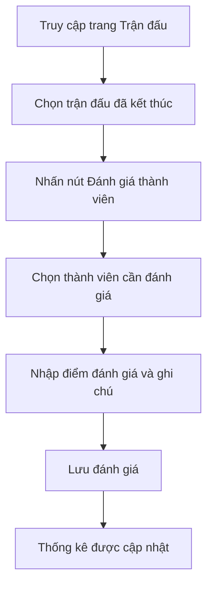

# Quản lý thành viên

## Tổng quan

Tính năng quản lý thành viên là một trong những tính năng cốt lõi của Football Manager. Nó cho phép người quản lý đội bóng theo dõi thông tin chi tiết về các thành viên trong đội, đánh giá hiệu suất và quản lý sự tham gia của họ trong các trận đấu.

## Chức năng chính

### 1. Danh sách thành viên

Hiển thị danh sách tất cả thành viên trong đội bóng với các thông tin cơ bản và cho phép tìm kiếm, lọc theo nhiều tiêu chí.

**Giao diện:**
- Bảng danh sách với phân trang
- Bộ lọc theo vị trí, trạng thái, độ tuổi
- Tìm kiếm theo tên, số điện thoại

**Chức năng kỹ thuật:**
- Sắp xếp theo nhiều tiêu chí
- Export dữ liệu ra Excel/CSV
- Hiển thị trạng thái hoạt động

### 2. Thông tin chi tiết thành viên

Hiển thị và quản lý thông tin chi tiết của từng thành viên.

**Thông tin cơ bản:**
- Họ tên, ngày sinh, số điện thoại
- Email, địa chỉ
- Ảnh đại diện

**Thông tin bóng đá:**
- Vị trí sở trường
- Chân thuận (trái/phải)
- Chiều cao, cân nặng
- Đánh giá kỹ thuật (1-10)
- Đánh giá thể lực (1-10)

**Thống kê:**
- Số trận tham gia
- Số bàn thắng/kiến tạo
- Đánh giá trung bình
- Biểu đồ hiệu suất theo thời gian

### 3. Thêm/Sửa/Xóa thành viên

Cho phép quản lý thông tin thành viên.

**Quy trình thêm thành viên:**
1. Nhập thông tin cơ bản
2. Tải lên ảnh đại diện (tùy chọn)
3. Nhập thông tin bóng đá
4. Xác nhận và lưu

**Quy trình sửa thông tin:**
1. Chọn thành viên cần sửa
2. Chỉnh sửa thông tin
3. Xác nhận và lưu

**Quy trình xóa thành viên:**
1. Chọn thành viên cần xóa
2. Xác nhận xóa
3. Hệ thống lưu trữ lịch sử xóa

### 4. Theo dõi sự tham gia

Theo dõi sự tham gia của thành viên trong các hoạt động của đội.

**Chức năng:**
- Điểm danh tham gia tập luyện
- Điểm danh tham gia trận đấu
- Thống kê tỷ lệ tham gia
- Ghi chú lý do vắng mặt

### 5. Đánh giá hiệu suất

Đánh giá hiệu suất của thành viên sau mỗi trận đấu.

**Tiêu chí đánh giá:**
- Kỹ thuật (1-10)
- Thể lực (1-10)
- Tinh thần (1-10)
- Đóng góp chung (1-10)
- Ghi chú đánh giá

## Luồng làm việc

### Quản lý thành viên mới



### Đánh giá thành viên sau trận đấu



## API Endpoints

### Thành viên

| Endpoint | Method | Mô tả |
|----------|--------|-------|
| `/api/members` | GET | Lấy danh sách thành viên |
| `/api/members/:id` | GET | Lấy thông tin chi tiết thành viên |
| `/api/members` | POST | Thêm thành viên mới |
| `/api/members/:id` | PUT | Cập nhật thông tin thành viên |
| `/api/members/:id` | DELETE | Xóa thành viên |

### Đánh giá

| Endpoint | Method | Mô tả |
|----------|--------|-------|
| `/api/members/:id/ratings` | GET | Lấy danh sách đánh giá của thành viên |
| `/api/members/:id/ratings` | POST | Thêm đánh giá mới |
| `/api/members/:id/ratings/:ratingId` | PUT | Cập nhật đánh giá |
| `/api/members/:id/ratings/:ratingId` | DELETE | Xóa đánh giá |

### Điểm danh

| Endpoint | Method | Mô tả |
|----------|--------|-------|
| `/api/members/:id/attendance` | GET | Lấy lịch sử điểm danh |
| `/api/matches/:id/attendance` | POST | Điểm danh cho trận đấu |
| `/api/training/:id/attendance` | POST | Điểm danh cho buổi tập |

## Cấu trúc dữ liệu

### Member

```typescript
interface Member {
  id: string;
  name: string;
  phone: string;
  email?: string;
  birthYear: number;
  position: Position;
  preferredFoot: 'left' | 'right' | 'both';
  height?: number;
  weight?: number;
  technicalRating: number;
  physicalRating: number;
  avatarUrl?: string;
  isActive: boolean;
  joinedAt: Date;
  createdAt: Date;
  updatedAt: Date;
}

enum Position {
  GOALKEEPER = 'GOALKEEPER',
  DEFENDER = 'DEFENDER',
  MIDFIELDER = 'MIDFIELDER',
  FORWARD = 'FORWARD'
}
```

### Rating

```typescript
interface Rating {
  id: string;
  memberId: string;
  matchId?: string;
  technical: number;
  physical: number;
  mental: number;
  overall: number;
  notes?: string;
  createdAt: Date;
  updatedAt: Date;
}
```

### Attendance

```typescript
interface Attendance {
  id: string;
  memberId: string;
  eventId: string;
  eventType: 'MATCH' | 'TRAINING';
  status: 'PRESENT' | 'ABSENT' | 'LATE';
  reason?: string;
  createdAt: Date;
  updatedAt: Date;
}
```

## Tài liệu liên quan

- [API Documentation](../api/members-api.md)
- [Database Schema](../setup/database-schema.md)
- [Quản lý trận đấu](./matches.md)
- [Quản lý đội hình](./lineup.md) 